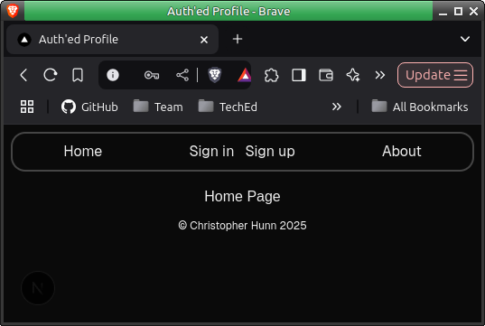
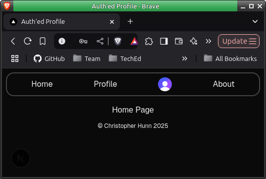

### Week 9 Assignment

## Build a Social Network

#### User Stories

🐿️ As a user, I want to sign up and log in securely using Clerk so that I can interact with the app as a user on the site and edit my user profile.

🐿️ As a user, I want to see an error/not found page (using error.js or not-found.js) if I try to visit a page on the site which doesn’t exist.

🐿️ As a user, I want an enhanced user experience with modern UI components, such as using a Radix UI Primitive or a similar library, so that the interface is more intuitive and visually appealing.

🐿️ As a user, I want to create and manage my profile, including adding information like a biography, so that I can personalise my account.

🐿️ As a user, I want to create my posts to be displayed on my profile page so that I can share and manage my content easily.

#### Requirements

🎯 Set up user sign-up and user login using Clerk.

🎯 Create and display an error/not found page if the user visits a page that doesn’t exist.

🎯 Use 1 or more Radix UI Primitive component, or something similar (e.g. use of a different component library to enhance UX, not just Tailwind).

🎯 Enable users to create a user profile, and input profile information (such as a user biography) using a form. Users and user information should be stored in their own table in the database and handled with an appropriate route (e.g. /user/[userId]).

🎯 Enable users to create posts associated with their Clerk userId. Posts should be displayed on the user’s profile page.

---

### Checkpoint 1

I now have a basic page with Home,Profile,Sign in,Sign up and About page, I have the header functionality working, as can be seen here.

I do not have authentication page protection at this stage, I plan to add this in when I have a something more to protect.

---

### Checkpoint 2

Up until now I've had a complete misunderstanding of the assignment, I understand that I need to use an external component library, on the one hand Manny noted that we do not need to create,update or delete posts (44.53 in the recording), this caused some confusion when looking at the last requirement in the list:

🎯 Enable users to create posts associated with their Clerk userId. Posts should be displayed on the user’s profile page.

After reviewing the recording I suspect that Manny was referring to 'comments on posts' - I recommend that Tech Ed differentiate between the different things that can be called posts - Blog posts, comment posts, profile posts, you get the idea.

This requirement above (create posts associated with their Clerk userId) has been met, when the user visits the profile button in the navigation bar if no profile exists they will be directed to a form to create a profile -> this is a 'post' that gets saved in the user*profile table containing Display Name, Bio and the clerk userId and these (name and bio) \_are* displayed on the users profile page - little voice in my head - "but Chris we said posts - plural" so I will also add a post creation mechanism so I am going for belts and braces after the stinging markdown last week after I successfully implemented deletion of 'the wrong post' I will also add post creation this week. (I'm still mad about that, like the week 4 assignment score not being corrected, I'm building up for a rage quit!)

As we stand with this commit I have added a 'newpost' route and this has been protected using clerk, its a placeholder at this stage but I have been able use it to test the clerk based access control and it is working.

---

### Checkpoint 3

I now have a the newpost route working, rediecting the user back to their profile page displaying the new post, the Home page displays all posts, in both cases the latest post is at the top, I use a single component for this - CommentList.jsx it is is given a who="" we get the full list if we use who={clerk-user-id} we get just the posts from the correct user.

If a user tries to make a post without first creating a profile they will be directed to profile creation page.

If a user enters /newpost and are not logged in they will be redirected to the sign in page.

requirements check:

🎯 Set up user sign-up and user login using Clerk. - DONE

🎯 Enable users to create a user profile, and input profile information (such as a user biography) using a form. Users and user information should be stored in their own table in the database and handled with an appropriate route (e.g. /user/[userId]). - DONE

🎯 Enable users to create posts associated with their Clerk userId. Posts should be displayed on the user’s profile page. - DONE

next up I want to create a page to display on error and(or) not found.

---

notes:

Another student noted that playing with a component library cleared out their default styles, so I saved mine to /misc/backup-globals.css
